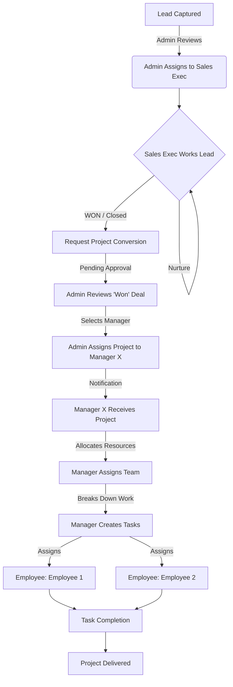

# CRM Leads to Project Workflow Documentation

This document outlines the end-to-end flow for the **DinTask** application, detailing how a **Lead** typically originates, is processed by **Sales**, approved by **Admin**, and finally executed by **Managers** and **Employees** through task management.

---

## 👥 User Roles & Responsibilities

| Role | Key Responsibility |
| :--- | :--- |
| **Admin** | **Central Control**: Assigns leads to Sales, and assigns resulting Projects to Managers. |
| **Sales Executive** | **Lead Nurturing**: Contacts leads, conducts meetings, sends proposals, and **closes** the deal. |
| **Manager** | **Project Orchestration**: Receives assigned Projects from Admin. Assigns Teams and Tasks. |
| **Employee** | **Execution**: Receives task assignments within a project and completes the work. |

---

## 🔄 End-to-End Workflow

### Phase 1: Lead Management (Admin → Sales)

**1. Lead Capture & Assignment (Admin)**
*   **Input**: Leads enter the system via Website Inquiry, Excel Import, or Manual Entry.
*   **Default State**: `Status: New`, `Owner: Unassigned`.
*   **Action**: Admin reviews "New" leads on the **Leads Dashboard**.
*   **Assignment**: Admin selects a lead and assigns it to a **Sales Executive**.
    *   *System Event*: Notification sent to the specific Sales Executive.

**2. Sales Process (Sales Executive)**
*   **View**: Sales Executive sees the lead in their **"My Pipeline"** / **Deals** view.
*   **Progression**:
    *   *Contacted*: Calls/Emails made.
    *   *Meeting*: Requirements gathered.
    *   *Proposal*: Quotation sent.
*   **Goal**: Mark the lead as **"Won"** (Closed Deal).
*   **Trigger**: When `Status` changes to `Won`, the Sales Executive clicks **"Request Project Conversion"**.

---

### Phase 2: Project Assignment (Sales → Admin → Manager)

**3. Conversion Request (Sales -> Admin)**
*   **Status**: The deal enters a **"Pending Project Approval"** state.
*   **Notification**: Admin receives a notification: "Deal [Client Name] Won by [Sales Rep]. Pending Manager Assignment."

**4. Manager Assignment (Admin)**
*   **View**: Admin goes to **Projects > Pending Assignment**.
*   **Action**: Admin reviews the project details/scope.
*   **Decision**: Admin selects a specific **Manager** (from the list of multiple managers) to handle this project.
*   **Handoff**: The Project is officially created and routed to that specific **Manager's Dashboard**.

---

### Phase 3: Project & Task Management (Manager → Employee)

**5. Project Setup (Manager)**
*   **View**: Manager sees a notification: "New Project [Project Name] Assigned by Admin".
*   **Action**: Manager opens the Project Setup page.
    *   *Team Allocation*: Selects a **Team** or specific **Employees** for this project.
    *   *Timeline*: Sets project start/end dates.

**6. Task Distribution (Manager)**
*   **Action**: Manager breaks down the Project into **Tasks**.
    *   *Example*: "Design UI", "Setup Database", "Content Writing".
*   **Assignment**: Manager assigns specific tasks to **Employees** (Team Members).

**7. Execution (Employee)**
*   **View**: Employee sees assigned tasks in their **"My Tasks"** dashboard.
*   **Action**: Employee works on tasks, updates status (`In Progress` -> `Completed`), and uploads deliverables.
*   **Completion**: Once all tasks are done, Manager marks the **Project** as `Completed`.

---

## 💻 Frontend Implementation Guide

### 1. View: Admin Dashboard
*   **Page**: `Leads Management`
    *   Feature: Assign Lead to Sales Rep.
*   **Page**: `Project Assignments` (New)
    *   Feature: List of "Won" deals awaiting manager.
    *   Action: Dropdown "Assign Manager" -> Save.

### 2. View: Sales Dashboard (`/sales/deals`)
*   **Component**: `KanbanBoard`
*   **Feature**: "Won" button triggers a "Submit to Admin" action instead of direct project creation.

### 3. View: Manager Dashboard (`/manager/projects`)
*   **Component**: `ProjectList`
*   **Feature**: Only shows projects assigned specifically to *this* logged-in manager.

### 4. View: Employee Dashboard (`/user/tasks`)
*   **Component**: `TaskCard`
*   **Feature**: See tasks assigned by their Manager.

---

## 📊 Flowchart Visualization

